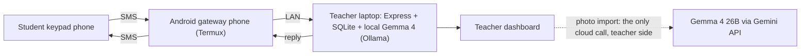

# Abhyaas (अभ्यास)

**SEE maths and science practice on any phone, by plain SMS, no internet.**

<!-- TODO: replace with the demo video link -->
**Demo video:** [watch (TODO link)](TODO-demo-video-link)

<!-- TODO: add the keypad-phone photo -->


<!-- TODO: add the three screenshots -->
| SMS simulator (`/phone`) | Teacher dashboard (`/`) | Photo import (`/import`) |
|---|---|---|
|  |  |  |

## The problem

- Many SEE (Grade 10) students in Nepal have only a keypad phone: no apps, no browser.
- Mobile data is weak or unaffordable in rural Nepal, so online practice platforms don't reach them.
- There are no tutors nearby to explain why an answer was wrong.

## How it works



One student's message:

1. The student texts `B` (or `b ho`, or `mero answer c`) to the school's number.
2. The gateway phone reads it and posts it to the teacher's laptop over the LAN.
3. **Code grades it.** The letter is compared with the stored answer. Free text goes through a regex first, then a match on the option values, and only then Gemma, which maps it to A-D or "unknown".
4. **The reply:**
   - Right: "Correct!" plus the student's streak.
   - First wrong try: the teacher-approved explanation of that exact mistake, then "Try again".
   - Second wrong try: the answer and the solution.
   - Every reply is checked to fit one SMS (≤160 GSM-7) and is queued.
5. The gateway texts the reply back. The dashboard updates live: first-try accuracy, weak topics, common misconceptions and the doubts inbox.

## How we use Gemma 4

| Model | Where | What it does |
|---|---|---|
| **Gemma 4 E4B** | Locally via Ollama, offline | Maps free-text replies (including Romanized Nepali) to A-D; answers maths concept questions (`ASK what is HCF?`); drafts wrong-option explanations for teachers to review |
| **Gemma 4 26B** | Gemini API, teacher side only | Photo import: reads a photo of an exam page (multimodal) and drafts one MCQ card per sub-part |

We switched thinking off for the SMS path: about **11 s → 0.5-4 s per call**.

## Why it's an open-source AI project

- **MIT licensed**, all code in this repo.
- **Open-weight model** (Gemma 4), no paid API in the student path.
- **Runs offline on one laptop**: students need no internet, and neither does the school.
- **No student data leaves the school.** Only phone, name and class are stored, and phone numbers are masked on every screen and log (`98******01`).

## Safety

- **The AI never grades.** Code compares the reply letter with the stored correct option.
- **Only teacher-approved questions and explanations reach students** (`npm run questions:review`, `npm run explain:review`).
- **Science is never answered by the model.** It may only rephrase a teacher-approved solution; any other science question gets a canned reply and goes to the teacher as a doubt.
- **Every SMS is ≤160 GSM-7 characters**, measured by code (extension characters count as 2). No Devanagari, emoji or smart quotes.
- **Canned fallbacks**: every model call has a timeout and a fixed reply, so the SMS loop never crashes or goes silent.
- **`validateQuestion()` is the only gate for questions.** It compares maths options by value (`2/4` = `1/2`, `x^2-1` = `(x-1)(x+1)`), recomputes the arithmetic in every solution step, and checks that the solution ends at the correct option.

## What we found testing Gemma 4

- **Explanations:** Gemma drafted explanations for 66 wrong options.
  - Code checks rejected 4 entirely: every wording Gemma tried gave the answer away.
  - Of the 62 that passed, 47 were approved unchanged and 15 needed a teacher rewrite. Examples: profit % worked out on the selling price, "no gravity on the Moon", a wrong method.
- **The checks also blocked 5 hints written by a person.**
- **Gemma misread a described answer** ("the one where VAT is added to 1800"), so letters are matched in code first and the model is the last resort.
- **Photo import:** 6 sub-parts became 6 cards, and 2 were correctly flagged as not SMS-suitable. It takes about 97 s per photo.

## Run it

Needs Node 20+ and [Ollama](https://ollama.com).

```sh
git clone https://github.com/kushalbista3/Abhyaas.git && cd Abhyaas
cp .env.example .env          # GEMINI_* only needed for photo import
ollama pull gemma4:e4b
npm install && npm run demo:reset
npm run dev
```

- Dashboard: http://localhost:5173
- SMS simulator: http://localhost:5173/phone
- Photo import: http://localhost:5173/import

`npm test` runs the test suite. For real SMS, set up an Android phone as the gateway: [gateway-phone/README.md](gateway-phone/README.md).

## Limitations

- One school per laptop.
- Each SMS costs money, on the student's side and the gateway's.
- Long science explanations get dropped to fit one SMS.
- Photo import needs internet and takes about 1-2 minutes per photo.

## Built at

**Hacktoberfest Hack Day Dhulikhel x KUMSC (MLH), 8 Oct 2026.**
- All code, questions and explanations in this repo were made at the event.
- An earlier prototype exists separately: [prototype (TODO link)](TODO-prototype-link). <!-- TODO: prototype link -->

**Next:**
- Question banks for entrance prep and Lok Sewa
- LEARN revision cards
- Multi-school support

## Licence and credits

[MIT](LICENSE).

Thanks to:
- **Gemma 4** by Google
- **Ollama**
- **MLH**
- **DEV**
- **DigitalOcean**
